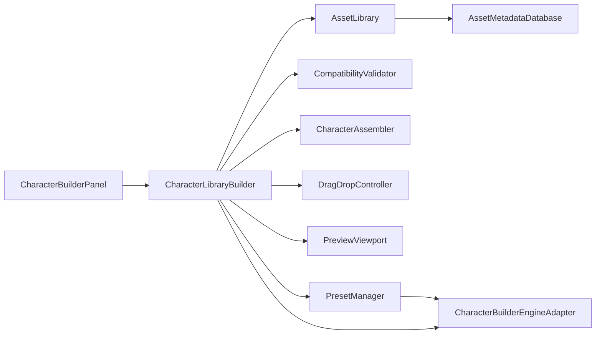

# Character Library Builder

Este documento deja trazabilidad para cualquier agente que entre despues al repo.

## Objetivo

`CharacterLibraryBuilder` es el modulo de ensamblado modular de personajes dentro del editor. Su alcance actual es:

- cargar una biblioteca de piezas modulares
- normalizar metadata y categorias
- validar compatibilidad por categoria, `skeletonId`, `bodyType` y `attachmentSocket`
- equipar y reemplazar piezas por slot
- manejar drag-and-drop de thumbnails a zonas de drop
- mantener un preview 3D local con cuerpo base y piezas activas
- guardar y cargar presets serializados como JSON

## Implementacion actual

Codigo principal:

- `src/engine/character-builder/types.ts`
- `src/engine/character-builder/metadataDatabase.ts`
- `src/engine/character-builder/assetLibrary.ts`
- `src/engine/character-builder/compatibilityValidator.ts`
- `src/engine/character-builder/characterAssembler.ts`
- `src/engine/character-builder/dragDropController.ts`
- `src/engine/character-builder/previewViewport.ts`
- `src/engine/character-builder/presetManager.ts`
- `src/engine/character-builder/characterLibraryBuilder.ts`
- `src/engine/editor/CharacterBuilderPanel.tsx`
- `src/engine/editor/characterBuilderEditorAdapter.ts`

## Responsabilidades

`AssetMetadataDatabase`

- normaliza registros crudos a metadata consistente
- resuelve categorias canonicas
- infiere sockets y flags base cuando faltan

`AssetLibrary`

- consulta piezas por categoria
- aplica filtros de busqueda, `bodyType` y `tag`
- expone tags y cuerpos base disponibles

`CompatibilityValidator`

- valida que una pieza pueda entrar en un slot dado
- compara categoria, socket, `skeletonId` y `bodyType`

`CharacterAssembler`

- mantiene `baseBodyId`
- mantiene `equippedParts`
- serializa y reconstruye presets
- limpia piezas incompatibles al cambiar de cuerpo base

`DragDropController`

- gestiona pieza arrastrada
- calcula slots validos a resaltar

`PreviewViewport`

- guarda yaw, pitch y zoom del preview
- desacopla controles de camara del panel UI

`PresetManager`

- persiste presets via adapter
- hoy usa JSON en `localStorage`
- manana puede migrarse a API o filesystem sin romper el nucleo

`CharacterLibraryBuilder`

- orquesta biblioteca, validacion, ensamblado, preview y presets
- expone aliases alineados al lenguaje del brief:
  - `open_character_builder`
  - `rebuild_asset_library`
  - `enable_drag_drop_mode`

## Diagrama logico

## Wrappers y limites actuales

No se invento una API privada del motor. En su lugar existe `CharacterBuilderEngineAdapter`.

El adaptador actual hace esto:

- carga metadata desde `public/library/*.metadata.json`
- usa fallbacks conocidos si falta un JSON
- guarda presets JSON en `localStorage`
- reporta eventos al `consoleManager`

Faltan wrappers reales del engine para:

- attachment de piezas skinned a sockets verdaderos del runtime
- deteccion de drop sobre el personaje 3D dentro del viewport global
- persistencia en disco o backend de presets
- sincronizacion del personaje ensamblado con el `SceneView`

## Por que no esta metido dentro de una sola funcion

Hacer esto como una sola funcion seria mala practica porque mezclaria:

- metadata
- validacion
- estado de ensamblado
- UI
- preview
- persistencia
- integracion con engine

Eso volveria imposible sumar despues:

- morphs
- color variants
- materiales
- sockets reales
- random avanzado
- filtros por raza o clase
- marketplace interno de piezas

## Siguiente paso recomendado

Para convertirlo en integracion total de runtime, el siguiente incremento correcto es un `SceneCharacterBridge` que:

- traduzca `equippedParts` a nodos reales del viewport
- use `ModelLoader` y attachment a sockets
- actualice preview y escena con la misma fuente de estado

## Contexto del archivo de ideas

El archivo del usuario tambien enumera tres sistemas grandes adicionales:

- editor avanzado de animacion esqueletica
- modelado topologico con brush inteligente
- pipelines 2D/imagen/foto/video a 3D

La base de esos tres ya vive ahora en:

- `src/engine/systems/animation-authoring/`
- `src/engine/systems/topology-authoring/`
- `src/engine/systems/conversion-pipeline/`

La documentacion compartida para agentes nuevos esta en `src/engine/systems/README.md`.
