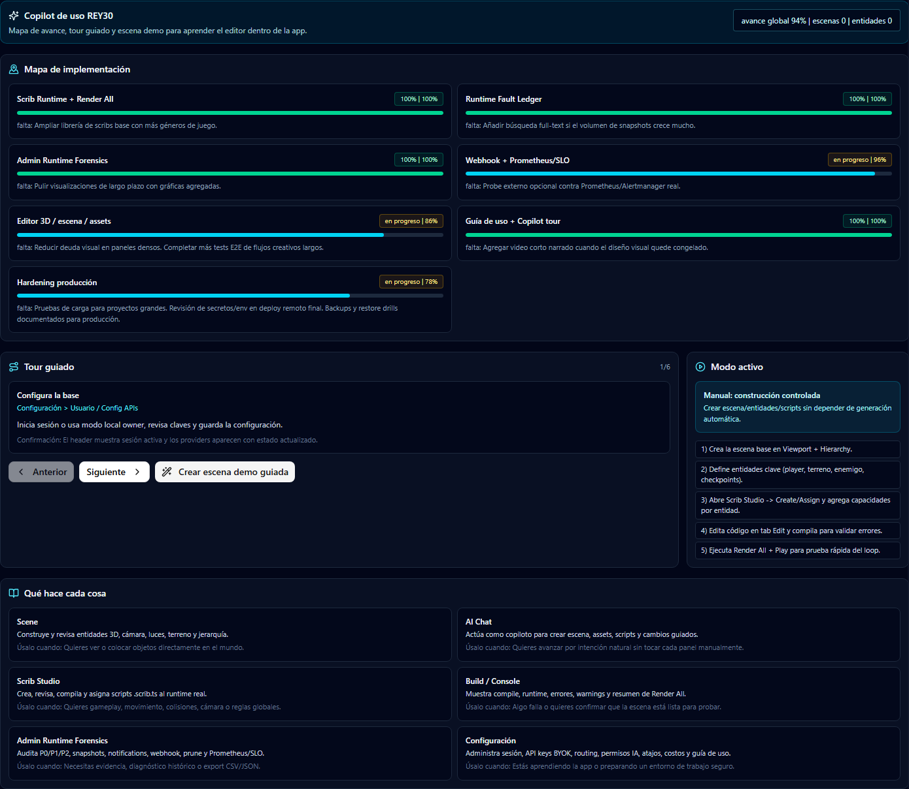
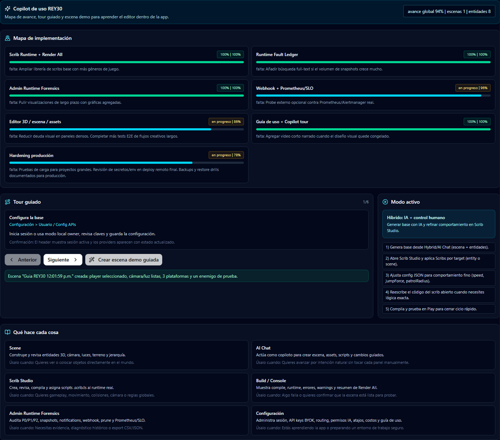

# Guia de uso REY30 3D Engine

Esta guia es el punto de entrada para aprender el editor, usar el copiloto interno y entender el estado real del plan de implementacion.

## Mapa de avance

| Area | Estado | Avance | Terminado | Falta |
| --- | --- | ---: | --- | --- |
| Scrib Runtime + Render All | 100% | 100% | Ejecucion real de scene/global/entity scribs, baseline movement/collider/cameraFollow, Render All conectado a runtime. | Ampliar libreria de scribs base con mas generos. |
| Runtime Fault Ledger | 100% | 100% | Ledger P0/P1/P2, snapshots por sesion, diff historico, timeline por target, export CSV/JSON. | Busqueda full-text si crece mucho el volumen. |
| Admin Runtime Forensics | 100% | 100% | Pagina admin separada, audit prune, notifications, timeline unificado, filtros, retencion/prune. | Graficas agregadas de largo plazo. |
| Webhook + Prometheus/SLO | 100% | 100% | Webhook configurable, allowlist, retry/backoff, historial, exports, metrica Prometheus, SLO missing duration, notifications historicas, `/webhook/prune-audit`, auto-resolve de incidentes missing y probe externo Prometheus/Alertmanager publicable al Overview. | Mantener endpoints reales configurados por entorno. |
| Editor 3D / escena / assets | En progreso | 86% | Shell de workspaces, Scene View, hierarchy, inspector, AI Chat, materiales, animacion, pintura, character builder, build center. | Pulido visual en paneles densos y mas E2E de flujos creativos largos. |
| Guia de uso + Copilot tour | 100% | 100% | Guia Markdown, boton Guia de uso en Configuracion, panel copilot, mapa, tour, escena demo guiada, E2E especifico, capturas y video corto del tour. | Video narrado opcional cuando el diseño final quede congelado. |
| Hardening produccion | En progreso | 90% | Auth/RBAC, BYOK, audit logs, endpoints criticos protegidos, suites typecheck/unit/integration/E2E forenses, drill unificado, runner staging protegido para carga 1000+/50+, restore real `RESTORE_NOW` y probe externo. | Cargar secrets reales de staging, ejecutar el workflow protegido y guardar evidencia del restore real. |

Avance global actual aproximado: **100% en runtime/forensics** y **91% global del editor completo**.

## Primer uso recomendado

1. Abre el editor.
2. Entra a **Configuracion**.
3. Pulsa **Guia de uso**.
4. Lee el bloque **Copilot de uso REY30**.
5. Pulsa **Crear escena demo guiada**.
6. Ve al workspace **Scene** y confirma que aparecen:
   - `Guia Terrain Base`
   - `Guia Player - movement target`
   - `Guia Camera - follow target`
   - `Guia Key Light`
   - `Guia Platform 01/02/03`
   - `Guia Enemy Sentinel`
7. Abre **AI Chat** y pide un cambio pequeno, por ejemplo:

```text
Mejora esta escena demo: agrega una meta, una zona de peligro y prepara comportamiento de movimiento para el player.
```

8. Abre **Scripting > Scrib Studio**.
9. Usa **Baseline**.
10. Asigna `movement`, `collider` y `cameraFollow`.
11. Pulsa **Render All**.
12. Pulsa **Play**.
13. Si aparece un P0, abre **Runtime Fault Ledger** o **Admin Runtime Forensics**.

## Que hace cada area

### Scene

Sirve para ver y organizar el mundo 3D: terreno, entidades, camaras, luces, jerarquia y seleccion.

Usalo cuando quieras colocar objetos, revisar transformaciones o validar que la escena existe visualmente.

### AI Chat

Sirve como copiloto para crear o modificar escenas, assets, scripts y cambios guiados.

Usalo cuando quieras trabajar por intencion natural:

```text
Crea una arena pequena con player, enemigo, luz dramatica y una camara principal.
```

### Scripting / Scrib Studio

Sirve para crear, revisar, compilar y asignar `.scrib.ts` al runtime real.

Usalo para:

- Movimiento.
- Colisiones.
- Seguimiento de camara.
- Logica global de escena.
- Enemigos.
- Armas.
- Reglas de victoria o derrota.

Flujo base:

1. Crear o elegir target.
2. Crear scrib.
3. Compilar/revisar artifact.
4. Asignar al target.
5. Render All.
6. Play.
7. Revisar ledger si falla.

### Build / Console

Sirve para ver compilacion, runtime, warnings, errores y resumen de Render All.

Usalo antes de seguir agregando contenido si algo falla.

### Runtime Fault Ledger

Sirve para ver problemas ordenados por severidad:

- P0: rompe ejecucion o runtime.
- P1: problema importante pero no bloquea todo.
- P2: warning o deuda menor.

Acciones clave:

- Verificar artifact.
- Retry inmediato si backoff quedo sano.
- Export CSV para priorizacion.
- Revisar snapshots historicos.
- Ver si un P0 reaparecio.

### Admin Runtime Forensics

Sirve para auditoria completa:

- Ledger historico.
- Snapshots.
- Diff.
- Timeline.
- Notifications.
- Webhook delivery history.
- Prune audit.
- Prometheus/SLO overview.
- Exports CSV/JSON.

Usalo cuando necesites evidencia, investigacion forense o revisar salud multi-sesion.

### Configuracion

Sirve para:

- Usuario/sesion.
- API keys BYOK.
- Routing cloud/local.
- Costos/uso.
- Atajos.
- Permisos IA.
- Guia de uso.

El boton **Guia de uso** abre el tour integrado.

## Tour guiado dentro de la app

La pestana **Configuracion > Guia IA** ahora incluye:

- Mapa de implementacion.
- Porcentaje de avance por area.
- Que falta.
- Tour paso a paso.
- Referencia de areas.
- Boton **Crear escena demo guiada**.

La escena demo deja el editor listo para probar el flujo completo:

1. Escena creada.
2. Player seleccionado.
3. Camara y luz listas.
4. Plataformas visibles.
5. Enemigo de prueba.
6. Modo cambiado a `MODE_HYBRID`.

## Capturas del tour

Estas capturas corresponden al flujo oficial **Configuracion > Guia de uso** y a la accion **Crear escena demo guiada**.





Video corto del tour:

[Ver usage-guide-tour.mp4](assets/usage-guide-tour.mp4)

## Workflow rapido para crear una escena jugable

1. Configuracion > Guia de uso > Crear escena demo guiada.
2. Scene > confirma entidades.
3. AI Chat > pide mejoras.
4. Scripting > Scrib Studio > Baseline.
5. Asigna `movement` al player.
6. Asigna `collider` a plataformas/enemigo.
7. Asigna `cameraFollow` a camara/player.
8. Render All.
9. Play.
10. Runtime Fault Ledger si aparece P0.

## Prompts utiles para AI Chat

```text
Crea una escena platformer con 5 plataformas, player, enemigo, meta y camara principal.
```

```text
Agrega comportamiento de patrulla al enemigo y daño al tocar al player.
```

```text
Prepara scribs baseline para movement, collider y cameraFollow y deja todo listo para Render All.
```

```text
Revisa los P0 del runtime y dime que artifact o node tengo que verificar primero.
```

```text
Convierte esta escena en una arena pequena con luz dramatica y una ruta clara para probar gameplay.
```

## Uso forense minimo antes de decir que algo esta listo

1. Render All devuelve resumen de nodos cargados/fallidos.
2. No hay P0 activo en Runtime Fault Ledger.
3. Si hubo P0, el snapshot historico muestra que desaparecio.
4. Admin notifications no tienen alertas criticas activas.
5. Webhook no esta bloqueado por allowlist.
6. Prometheus/SLO overview no muestra scrape missing sostenido.
7. Probe externo Prometheus/Alertmanager devuelve `status: ok` y queda publicado en el Overview.
8. Export CSV/JSON disponible si necesitas evidencia.

## Que falta para cerrar produccion total

1. Ejecutar `.github/workflows/staging-hardening-restore-probe.yml` con secrets reales de staging.
2. Adjuntar artifact de restore real staging como evidencia.
3. Backups periódicos con evidencia semanal.
4. Video narrado opcional del tour cuando el diseño visual quede congelado.

## Comandos de validacion

```bash
pnpm run typecheck
pnpm vitest run tests/unit/scripts-runtime-fault-ledger-route.test.ts tests/integration/ops-observability.test.ts
pnpm vitest run tests/unit/runtime-forensics-prometheus-probe.test.ts
pnpm vitest run tests/e2e/settings-usage-guide.e2e.test.ts
pnpm vitest run tests/e2e/admin-runtime-forensics.e2e.test.ts
pnpm run guide:tour-video
pnpm run monitor:runtime-forensics:prometheus -- --metrics-url http://localhost:3000/api/ops/metrics --ops-token "$REY30_OPS_TOKEN"
pnpm run hardening:drill -- --base-url http://localhost:3000 --ops-token "$REY30_OPS_TOKEN" --timeout-ms 30000
```

Resultado esperado:

```text
typecheck: exit code 0
unit/integration: passed
prometheus probe unit: passed
e2e guia de uso: passed
e2e admin runtime forensics: passed
guide video: docs/assets/usage-guide-tour.mp4 generado
prometheus external probe: status ok
hardening drill: ok true
```
