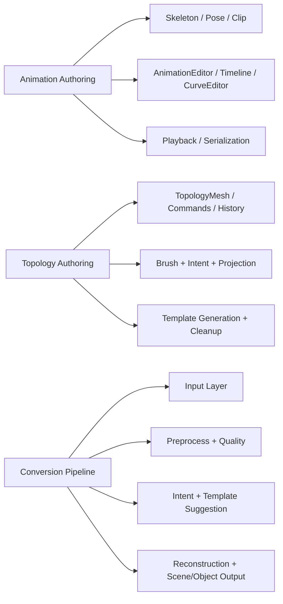

# Systems Foundation

Este directorio deja la base inicial de los tres sistemas grandes pedidos para el motor, separada por subsistemas y preparada para crecer sin mezclar UI, runtime y logica de autoria.

## Modulos actuales

- `animation-authoring/`
  Base para edicion avanzada de animacion esqueletica: datos, evaluacion, timeline, curvas, reproduccion, edicion no destructiva y serializacion.
- `topology-authoring/`
  Base para modelado topologico con dos modos: plantilla parametrica y dibujo libre inteligente con historial, validacion y conversion a `EditableMesh`.
- `conversion-pipeline/`
  Base para pipelines 2D/3D: sketch, multi-sketch, imagen unica, multi-image, fotos, video y scene scan, todo convergiendo a representaciones editables del motor.

## Mapa logico

## Responsabilidad de cada sistema

`animation-authoring`

- no toca la UI del editor directamente
- mantiene la logica de clips, keyframes, mezclas parciales y evaluacion de poses
- deja listo el puente para integrar viewport, IK, retargeting y layers despues

`topology-authoring`

- separa topologia editable, brush, intencion del usuario y generacion de proxies
- evita mezclar raycast, malla y UI en una sola clase
- produce `EditableMesh` listo para entrar al modeler existente

`conversion-pipeline`

- separa entradas, preproceso, clasificacion de intencion, reconstruccion y postproceso
- no promete malla final perfecta cuando la entrada es pobre
- puede devolver `EditableMesh`, `EditableObject3D` o `EditableScene3D`
- usa `ConversionEngineAdapter` para conectar commit real del motor despues

## Puntos de integracion pendientes

- conectar `animation-authoring` al viewport/editor actual para edicion visual de poses y curvas
- conectar `topology-authoring` al raycast y overlays reales del `SceneView`
- conectar `conversion-pipeline` a jobs async, import real de imagen/video y commit de resultados al scene graph

## Regla de arquitectura

La idea central de esta carpeta es no resolver estos problemas con una sola funcion gigante.

Si un agente entra despues, esta carpeta es la entrada correcta para seguir fortaleciendo:

- UX y paneles
- jobs asynchronos
- herramientas de preview
- persistencia avanzada
- integracion con runtime
